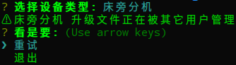

# vpm —— voerka 软件包管理器

## 概述

Voerka 软件包包括：
- 设备升级包
- 其它带扩展

Voerka 软件包存放于中心化的软件包管理服务器。

Voerka 软件包管理服务器相关信息：
- 地址：`192.168.110.12`
- 用户：`vpm`
- 密码：`vpm`

## 设备升级包管理

设备升级包管理包括：
- 生成设备升级包
- 其它待扩展

### 生成设备升级包

1. 上传设备升级文件（暂时只能手动）  
   上传位置：`vpm服务器:/home/vpm/packages/<设备类型名称>/raw`  
   设备类型名称：  
   `sickbedhost` - 床旁分机  
   `nshost` - 护士站主机  
   `sickroomhost` - 房门口机  

2. 登录 Voerka 软件包管理服务器  
   服务器信息见[概述](#概述)

3. 在登录用户终端执行 `vpm` 命令
   按照向导提示生成升级包  
   过程中如需退出，直接 `ctrl + c`  

注：当出现如下提示时，可能是已经存在其它用户正在进行生成升级包，此时只有等到其它用户退出，当前用户才能操作  

